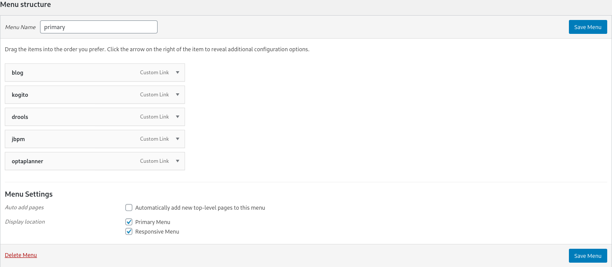

# KIE Blog WordPress Theme

Simple WordPress theme based on [WordPress Sixteen](https://github.com/WordPress/twentysixteen/) to beautify the KIE Team Blog website.

## Installation

It's recommended to use [WP Pusher](https://wppusher.com/) to handle installation and future updates on this theme. Just install the plugin and point it to this repository. If you have problems, follow [these instructions](https://www.codeinwp.com/blog/install-wordpress-plugins-from-github/). Remember to set the "sub directory" option to `theme`.

## Menu

This theme comes with two menu areas: the `primary` that you can see in the top of the page, and the `responsive`, which is only activated on small screen devices. Create a new menu from the "Appeareance > Menu" options in the dashboard and mark it to appear in the `primary` and `responsive` areas.

## Sidebar

In the sidebar area, we use one Widget for Shortcodes to be able to add a form for the [S&F Pro plugin](https://searchandfilter.com/).

## Jetpack Plugin

Jetpack hides all the `screen-reader-text` class from the elements (so it would be visible only by screen readers), that's why you might see some differences from the local deployed blog from the live one. It's not possible to install Jetpack locally.

## Local Development

It's recommended to set up a local development to test your changes before sending a PR. You could install [LAMP](https://en.wikipedia.org/wiki/LAMP_(software_bundle)) (or [LEMP](https://www.digitalocean.com/community/tutorials/how-to-install-linux-nginx-mysql-php-lemp-stack-ubuntu-18-04)), but we have a Minikube environment prepared on the [`kubernetes`](kubernetes) directory:

1. Install [Minikube](https://kubernetes.io/docs/tasks/tools/install-minikube/)

2. Install [kustomize](https://github.com/kubernetes-sigs/kustomize/blob/master/docs/INSTALL.md)

3. Mount a local directory to the Minikube instance (see [`mount.sh`](kubernetes/mount.sh)), this way whenever you make a change in the theme, it will be reflected automatically in the cluster

4. Run [`deploy.sh`](kubernetes/deploy.sh) to have your environment set for you

5. Set up your WordPress instance and install this plugin manually (zip the `theme` folder and upload it via Dashboard)

6. (Optional) Use [FakerPress](https://wordpress.org/plugins/fakerpress/) to have some mock data
